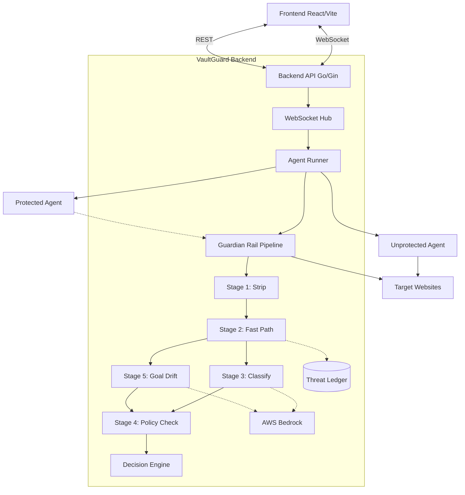
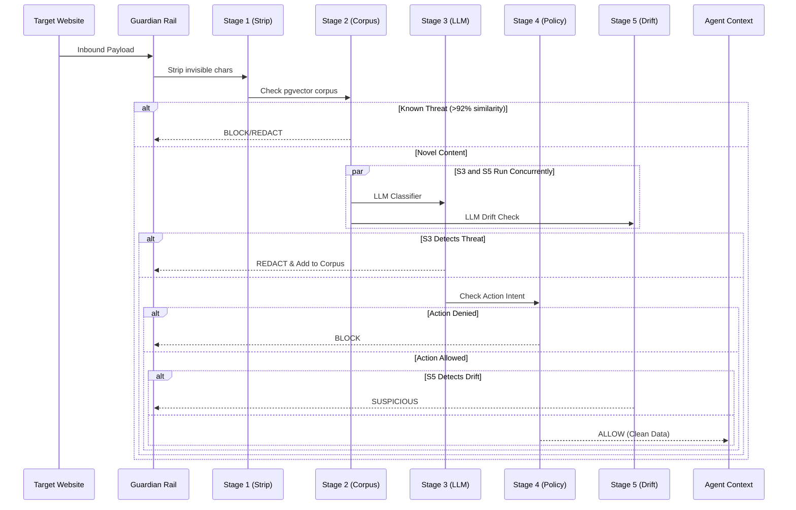

# VaultGuard Architecture

VaultGuard acts as an interception layer (Guardian Rail) between an AI Agent and external inputs. It leverages LLMs for semantic analysis and deterministic rules for policy enforcement.

## High Level Architecture

## Guardian Rail Pipeline

The pipeline processes every payload across 5 stages before allowing it into the agent's context.

