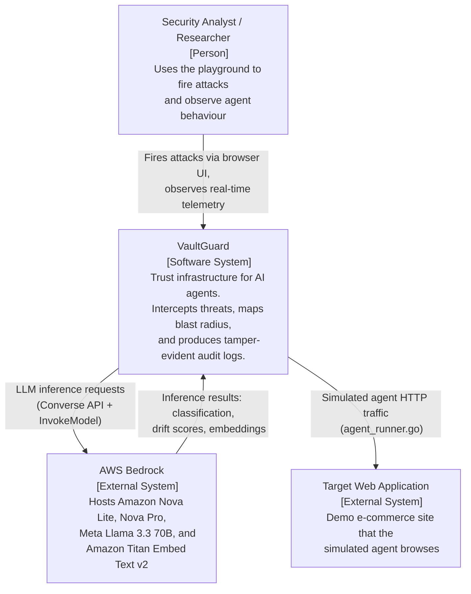
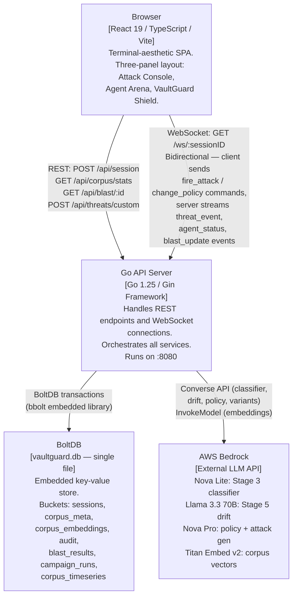
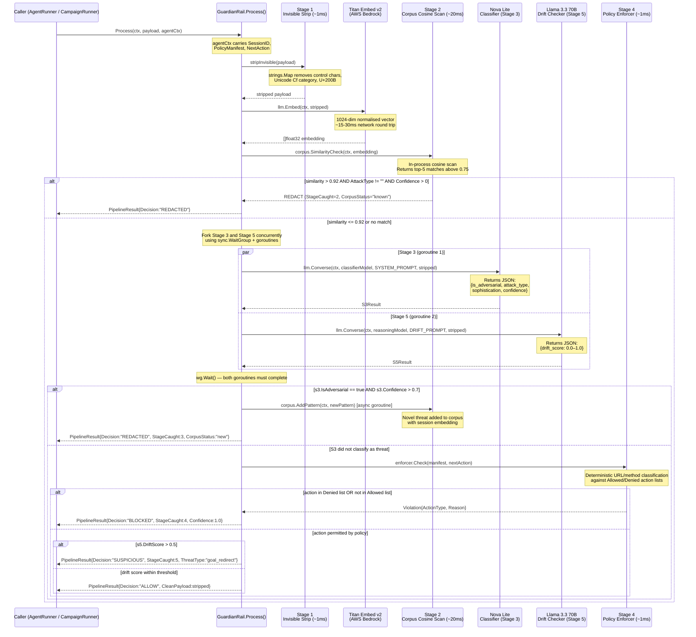
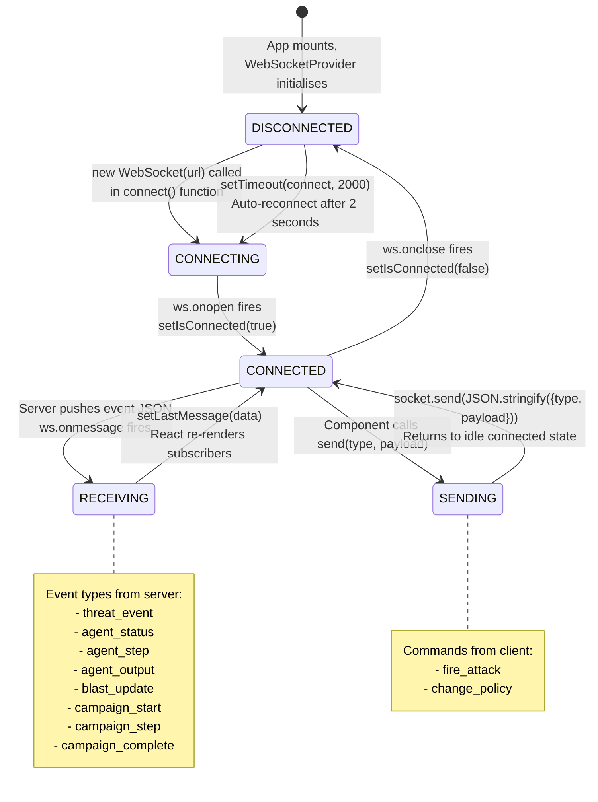
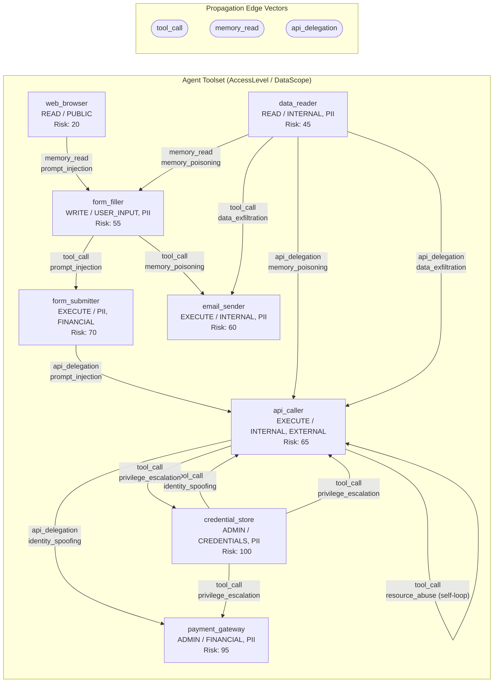
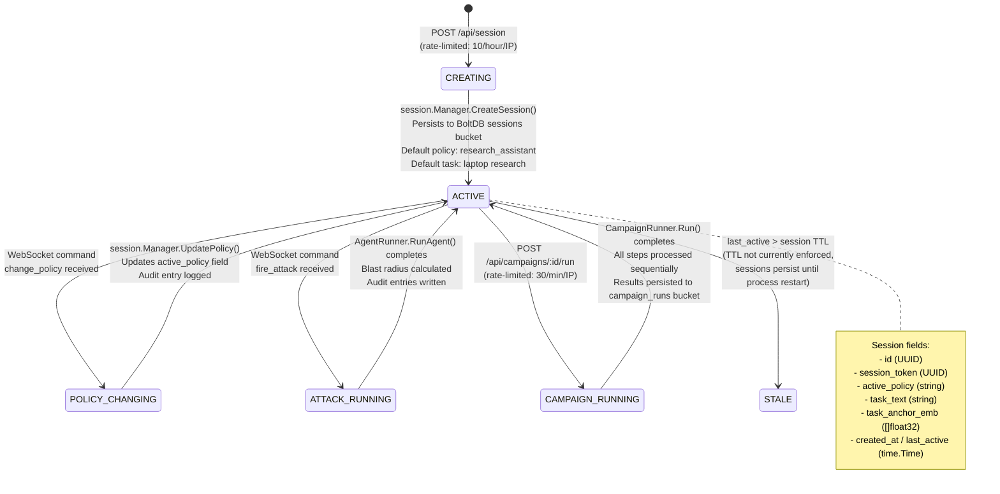
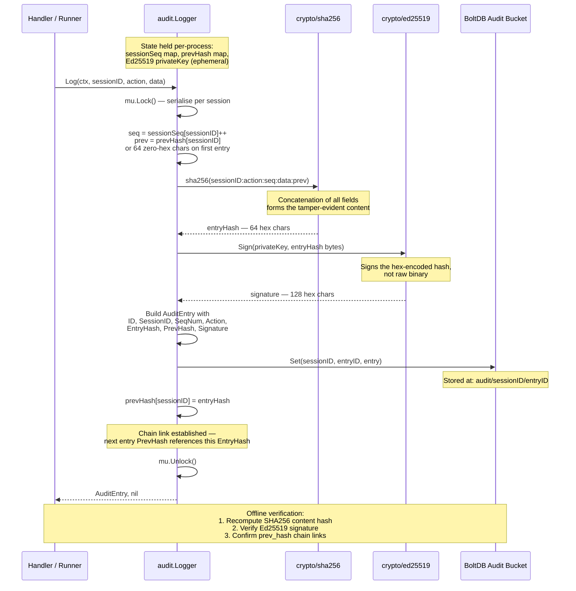
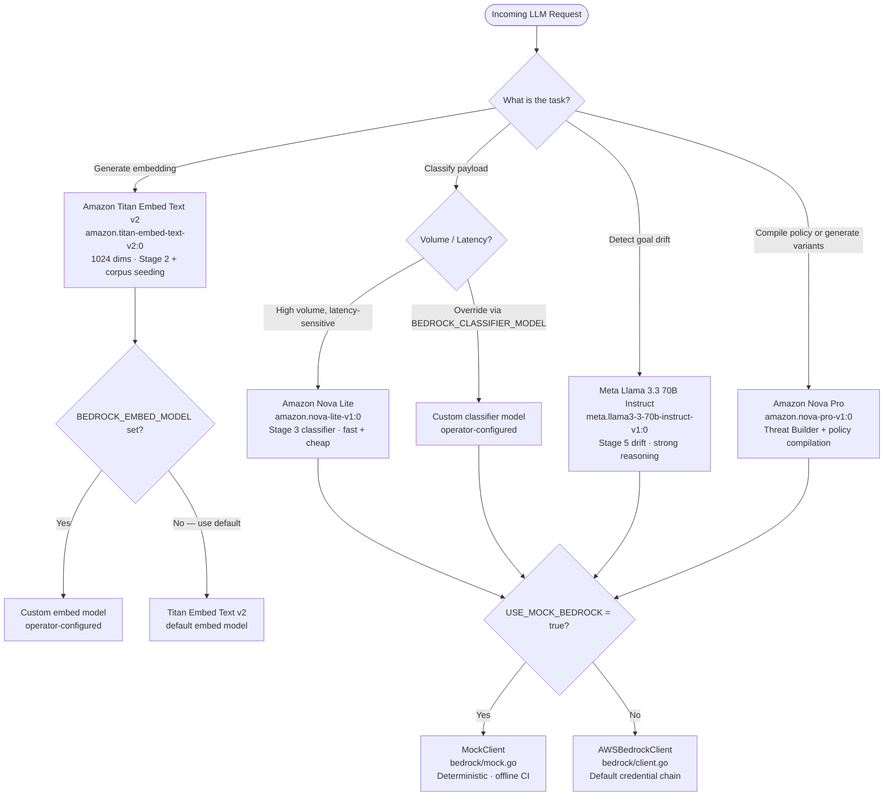

# VaultGuard Architecture

VaultGuard is a trust infrastructure for production AI agents. It acts as an interception layer between an AI agent and external inputs, providing semantic threat detection, deterministic policy enforcement, consequence mapping, and a tamper-evident audit trail. This document covers the system from the highest level (C4 context) down to protocol-level behaviour (WebSocket state machine, audit hash chain).

---

## Table of Contents

1. [System Overview](#system-overview)
2. [C4 Level 1 — System Context](#c4-level-1--system-context)
3. [C4 Level 2 — Container Diagram](#c4-level-2--container-diagram)
4. [Three Core Pillars](#three-core-pillars)
5. [Guardian Rail Pipeline Sequence](#guardian-rail-pipeline-sequence)
6. [WebSocket Protocol State Machine](#websocket-protocol-state-machine)
7. [Blast Radius Graph Schema](#blast-radius-graph-schema)
8. [Session Lifecycle](#session-lifecycle)
9. [Audit Hash Chain Construction](#audit-hash-chain-construction)
10. [Model Routing Decision Tree](#model-routing-decision-tree)
11. [Technology Stack](#technology-stack)
12. [Rate Limiting Architecture](#rate-limiting-architecture)
13. [Deployment Topology](#deployment-topology)

---

## System Overview

VaultGuard is built around three core pillars that together form a complete AI agent security posture:

| Pillar | Purpose | Key Metric |
|---|---|---|
| **Threat Ledger** | Semantic threat intelligence corpus with cosine similarity search | 540+ OWASP Agentic Top 10 patterns pre-seeded |
| **Guardian Rail** | 5-stage runtime defence pipeline intercepting threats before agent reasoning | Blocks threats in ~1ms (deterministic) to ~45ms (LLM) |
| **Blast Radius Engine** | Consequence mapping with 0–100 vulnerability scores and propagation graphs | 10 attack-type propagation maps across 8 tool nodes |

The system is designed to be cloud-native (AWS Bedrock for LLMs) but fully operable offline via a mock Bedrock client — enabling airgapped demos and CI without external dependencies.

---

## C4 Level 1 — System Context

This diagram shows VaultGuard as a black box, its users, and external systems it communicates with.



**Key relationships:**

- The analyst interacts exclusively through the React frontend, which communicates via REST and a persistent WebSocket connection.
- AWS Bedrock is the only external dependency. When `USE_MOCK_BEDROCK=true`, the system is fully self-contained.
- The "target web application" is simulated inside `agent/runner.go` — no live browser is spawned.

---

## C4 Level 2 — Container Diagram

This diagram shows the internal containers (processes and data stores) within VaultGuard and how they interact.



**Container responsibilities:**

- **Browser**: Renders the three-panel terminal UI. Maintains a single WebSocket connection per session. Does not persist state — all state lives in BoltDB via the Go backend.
- **Go API Server**: Owns all business logic. Seven sub-systems are wired together at startup in `cmd/server/main.go`: session manager, corpus/ledger, audit logger, blast engine, guardian rail, campaign runner, and WebSocket hub.
- **BoltDB**: A single file (`data/vaultguard.db`) on the server's local disk. Uses bbolt (etcd's BoltDB fork). No external database server required.
- **AWS Bedrock**: Invoked synchronously within the Guardian Rail pipeline (Stages 3 and 5) and asynchronously for variant generation in the custom threat builder.

---

## Three Core Pillars

### Pillar 1: Threat Ledger

The Threat Ledger is a semantic threat intelligence database that powers Stage 2 of the Guardian Rail. It stores threat patterns as both structured metadata (JSON in `corpus_meta` BoltDB bucket) and binary float32 embeddings (`corpus_embeddings` bucket, 4 bytes per dimension × 1024 dimensions = 4096 bytes per vector — ~73% more compact than JSON encoding).

At startup, `ledger.SeedIfNeeded()` checks whether the corpus has fewer than 100 patterns and, if so, expands 60 base entries across 8 evasion transforms (uppercase, `[SYSTEM]` prefix, authority framing, HTML comment wrapping, etc.) to produce **540 patterns** covering all 10 OWASP Agentic Top 10 categories.

Similarity search uses in-process cosine scan (`CosineSimilarity(a, b []float32)`) across the full embedding store loaded into memory — no pgvector extension required. Matches above 0.75 cosine similarity are returned; the pipeline blocks at > 0.92.

### Pillar 2: Guardian Rail

The Guardian Rail is the runtime interception layer described in detail in the [sequence diagram below](#guardian-rail-pipeline-sequence). Its defining property is the concurrent execution of the LLM classifier (Stage 3) and the goal-drift detector (Stage 5), which keeps worst-case latency close to the slower of the two LLM calls rather than their sum.

### Pillar 3: Blast Radius Engine

The Blast Radius Engine produces consequence maps for detected attacks. It uses a static propagation graph (`attackPropagationMap`) keyed by attack type to identify which of the 8 demo tool nodes (web browser, form filler, form submitter, data reader, API caller, email sender, payment gateway, credential store) are reachable from the attack vector, then scores the result using a multi-factor formula (see [scoring formula in LLD](LOW_LEVEL_DESIGN.md#blast-radius-scoring-algorithm)).

---

## Guardian Rail Pipeline Sequence

The following sequence diagram shows the full processing path for a single payload through all five stages, including the concurrent fork at Stage 3/5 and all possible outcomes.



**Stage timing characteristics:**

| Stage | Mechanism | Typical Latency | Block Condition |
|---|---|---|---|
| Stage 1 | `strings.Map` Unicode filter | ~1ms | Always runs; never blocks |
| Stage 2 | In-process cosine scan over corpus embeddings | ~20ms (scales with corpus size) | similarity > 0.92 AND known attack type |
| Stage 3 | AWS Bedrock Converse — Amazon Nova Lite | ~200–800ms (concurrent with S5) | `is_adversarial == true` AND `confidence > 0.7` |
| Stage 4 | In-process map lookup against policy manifest | ~1ms | Action in Denied list OR not in Allowed list |
| Stage 5 | AWS Bedrock Converse — Meta Llama 3.3 70B | ~300–1200ms (concurrent with S3) | `drift_score > 0.5` → SUSPICIOUS (not BLOCKED) |

Note that Stage 5 produces a SUSPICIOUS outcome rather than a hard BLOCK, because goal drift is probabilistic and may represent legitimate task expansion.

---

## WebSocket Protocol State Machine

The WebSocket connection between the frontend and backend is the primary real-time channel. The following state machine describes the connection lifecycle from the client's perspective.



**Server-to-client event payloads:**

| Event Type | When Emitted | Key Payload Fields |
|---|---|---|
| `threat_event` | Guardian Rail blocks or redacts | `agent_id`, `threat_type`, `confidence`, `stage`, `action`, `corpus_status` |
| `agent_status` | Agent state changes | `agent_id`, `status` (RUNNING / DEFENDED / COMPROMISED) |
| `agent_step` | Each simulated execution step | `agent_id`, `message`, `time` |
| `agent_output` | Agent produces final output | `agent_id`, `text` |
| `blast_update` | Blast radius calculated | Full `BlastResult` JSON |
| `campaign_start` | Campaign begins execution | `campaign_id`, `campaign_name`, `total_steps` |
| `campaign_step` | Each campaign payload processed | `step`, `payload_name`, `decision`, `threat_type`, `confidence`, `blast_score`, `severity`, `stage` |
| `campaign_complete` | Campaign run finishes | `campaign_id`, `score` (% blocked), `blocked`, `allowed`, `suspicious` |

---

## Blast Radius Graph Schema

The Blast Radius Engine models the agent's tool ecosystem as a directed graph where nodes are tool capabilities and edges are propagation vectors. The following diagram shows the full graph schema with all 8 tool nodes and their inter-connections grouped by propagation vector type.



**Node risk classification:**

- **ADMIN-level tools** (payment_gateway, credential_store): Risk scores 95–100. Any attack reaching these nodes generates a CRITICAL blast result.
- **EXECUTE-level tools** (form_submitter, api_caller, email_sender): Risk scores 60–70. Represent real-world side effects — form submissions, API calls, emails.
- **WRITE-level tools** (form_filler): Risk score 55. Intermediate step between passive observation and active effect.
- **READ-level tools** (web_browser, data_reader): Risk scores 20–45. Entry points for most attack paths; high data_reader risk due to INTERNAL/PII data scope.

---

## Session Lifecycle

A session is the fundamental unit of state in VaultGuard. It persists the active policy, task anchor text, and task anchor embedding used for goal-drift detection.



---

## Audit Hash Chain Construction

Every significant action in VaultGuard is recorded in a tamper-evident audit chain. Each entry is cryptographically bound to its predecessor using SHA-256 hashing and individually signed with Ed25519.



**Security properties of the audit chain:**

- **Tamper detection**: Any modification to a past entry invalidates its `entry_hash`, which cascades to break all subsequent `prev_hash` links.
- **Non-repudiation**: Each entry's Ed25519 signature can be verified with the public key exported via `GET /api/audit/:sessionID` (included in the PDF export header).
- **Ordering**: Entries are ordered by `seq_num` (monotonically increasing per session), not insertion time, making the chain resistant to race conditions.
- **Limitation**: The Ed25519 key pair is generated fresh at each server startup (`ed25519.GenerateKey(nil)`). Long-running deployments should persist the private key to maintain cross-restart signature validity.

---

## Model Routing Decision Tree

VaultGuard routes requests to different LLM models based on the task's latency budget and reasoning complexity requirements.



**Model override environment variables:**

| Variable | Default | Overrides |
|---|---|---|
| `BEDROCK_CLASSIFIER_MODEL` | `amazon.nova-lite-v1:0` | Stage 3 classification model |
| `BEDROCK_REASONING_MODEL` | `meta.llama3-3-70b-instruct-v1:0` | Stage 5 drift detection model |
| `BEDROCK_POLICY_MODEL` | `amazon.nova-pro-v1:0` | Policy compilation and variant generation |
| `BEDROCK_EMBED_MODEL` | `amazon.titan-embed-text-v2:0` | All embedding operations |
| `USE_MOCK_BEDROCK` | `""` (false) | Replaces all Bedrock calls with deterministic mock |

---

## Technology Stack

### Backend

| Component | Technology | Version / Notes |
|---|---|---|
| Language | Go | 1.25 |
| HTTP framework | Gin | github.com/gin-gonic/gin |
| WebSocket | gorilla/websocket | github.com/gorilla/websocket |
| Embedded database | BoltDB (bbolt) | go.etcd.io/bbolt |
| AWS SDK | aws-sdk-go-v2 | bedrockruntime service |
| PDF generation | gofpdf | github.com/jung-kurt/gofpdf |
| UUID generation | google/uuid | github.com/google/uuid |
| Cryptography | Standard library | crypto/ed25519, crypto/sha256 |

### Frontend

| Component | Technology | Version / Notes |
|---|---|---|
| Framework | React | 19 |
| Language | TypeScript | Strict mode |
| Build tool | Vite | Fast HMR dev server |
| Styling | Tailwind CSS | Terminal/hacker aesthetic |
| Graph visualisation | ReactFlow | Blast radius propagation graphs |
| Chart library | Recharts | Corpus timeseries charts |
| Icons | lucide-react | Shield, Zap, AlertTriangle, etc. |

### Infrastructure

| Component | Technology | Notes |
|---|---|---|
| Storage | BoltDB single file | `data/vaultguard.db` — no external DB required |
| LLM runtime | AWS Bedrock | Falls back to mock client automatically |
| Deployment | Single Go binary | `cmd/server/main.go` → `./server` |
| CORS | Inline Gin middleware | Allows all origins (demo mode) |

---

## Rate Limiting Architecture

VaultGuard implements a sliding window rate limiter per IP address for three distinct endpoint categories. The limiter is implemented in `internal/middleware/ratelimit.go` as a pure in-process solution (no Redis required).

```
Attack endpoints (POST /api/threats/custom, POST /api/campaigns/:id/run):
  └── 30 requests per 60-second sliding window per IP
  └── Response headers: X-RateLimit-Limit, X-RateLimit-Remaining, X-RateLimit-Window

Session creation (POST /api/session):
  └── 10 requests per 3600-second (1-hour) sliding window per IP

Audit export (GET /api/audit/:sessionID/export):
  └── 5 requests per 3600-second (1-hour) sliding window per IP
```

When a limit is exceeded, the server returns HTTP 429 with `Retry-After` header and a JSON body containing `error`, `limit`, and `retry_after` fields. A background goroutine evicts stale IP entries every 10 minutes to prevent unbounded memory growth.

---

## Deployment Topology

```
[Browser]
    │
    │ HTTP/WebSocket (localhost:5173 dev / nginx in prod)
    ▼
[Vite Dev Server / Static File Host]
    │
    │ Proxied API requests + WebSocket upgrade
    ▼
[Go API Server :8080]
    ├── data/vaultguard.db (BoltDB — local disk)
    └── AWS Bedrock (us-east-1 or $AWS_REGION)
         ├── amazon.nova-lite-v1:0
         ├── meta.llama3-3-70b-instruct-v1:0
         ├── amazon.nova-pro-v1:0
         └── amazon.titan-embed-text-v2:0
```

For production deployment, the Go binary and `data/` directory should be co-located. The BoltDB file uses file-level locking (`bbolt.Open` with `0600` permissions), so only one process may open it at a time. Horizontal scaling requires either migrating to a shared database (PostgreSQL + pgvector) or using a distributed KV store — the `store.BoltStore[T]` interface is designed for this substitution.
