# VaultGuard Low Level Design

This document describes the internal implementation of every significant subsystem in VaultGuard. It is intended for contributors who need to understand data flows, algorithm implementations, Go package dependencies, and frontend component wiring at the code level. All diagrams reference actual source files.

---

## Table of Contents

1. [Go Package Dependency Graph](#go-package-dependency-graph)
2. [BoltDB Bucket Hierarchy](#boltdb-bucket-hierarchy)
3. [Guardian Pipeline Class Diagram](#guardian-pipeline-class-diagram)
4. [Blast Radius Scoring Algorithm](#blast-radius-scoring-algorithm)
5. [Policy Enforcer Decision Flow](#policy-enforcer-decision-flow)
6. [Corpus Vector Search Flow](#corpus-vector-search-flow)
7. [WebSocket Hub Goroutine Model](#websocket-hub-goroutine-model)
8. [Audit Logger Chain Construction](#audit-logger-chain-construction)
9. [Campaign Execution Sequence](#campaign-execution-sequence)
10. [Rate Limiter Sliding Window](#rate-limiter-sliding-window)
11. [Frontend Component Tree](#frontend-component-tree)
12. [React WebSocket Context Data Flow](#react-websocket-context-data-flow)
13. [API Endpoint Reference Map](#api-endpoint-reference-map)
14. [Threat Builder Workflow](#threat-builder-workflow)
15. [Seed Corpus Import Flow](#seed-corpus-import-flow)
16. [BoltStore Generic Operations](#boltstore-generic-operations)
17. [Bedrock Model Routing Reference](#bedrock-model-routing-reference)

---

## Go Package Dependency Graph

The following diagram shows how the internal packages in `backend/internal/` depend on each other. Arrows indicate `import` relationships. Circular dependencies do not exist — the graph is a DAG.

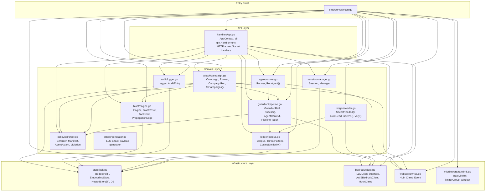

**Architectural notes:**

- `store/bolt.go` is the sole dependency on `go.etcd.io/bbolt` — all other packages receive `*store.DB` as a constructor argument, keeping them storage-agnostic.
- `bedrock/client.go` defines the `LLMClient` interface. All packages that call LLMs depend only on the interface, not the concrete `AWSBedrockClient`. This enables the mock to be swapped in transparently.
- `policy/enforcer.go` has zero external dependencies — it is purely deterministic string logic.
- `websocket/hub.go` has zero external dependencies besides the standard library.

---

## BoltDB Bucket Hierarchy

BoltDB organises data into top-level buckets and optional nested sub-buckets. The following diagram shows the complete bucket schema for `data/vaultguard.db`.

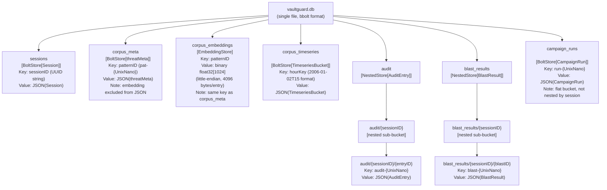

**Storage characteristics:**

| Bucket | Store Type | Key Format | Entry Size (approx) |
|---|---|---|---|
| `sessions` | `BoltStore[Session]` | UUID string | ~200 bytes JSON |
| `corpus_meta` | `BoltStore[threatMeta]` | `pat-{UnixNano}` | ~400 bytes JSON |
| `corpus_embeddings` | `EmbeddingStore` | same as corpus_meta | 4096 bytes binary |
| `corpus_timeseries` | `BoltStore[TimeseriesBucket]` | `2006-01-02T15` | ~200 bytes JSON |
| `audit` | `NestedStore[AuditEntry]` | `{sessionID}/{audit-{UnixNano}}` | ~600 bytes JSON |
| `blast_results` | `NestedStore[BlastResult]` | `{sessionID}/{blast-{UnixNano}}` | ~2KB JSON |
| `campaign_runs` | `BoltStore[CampaignRun]` | `run-{UnixNano}` | ~5KB JSON |

For 540 corpus entries: `corpus_meta` ≈ 216KB, `corpus_embeddings` ≈ 2.2MB total. The entire seeded database fits in approximately 5MB on disk.

---

## Guardian Pipeline Class Diagram

This diagram shows the types and interfaces involved in the Guardian Rail pipeline, including their fields and relationships.

```mermaid
classDiagram
    class GuardianRail {
        -corpus *ledger.Corpus
        -enforcer *policy.Enforcer
        -llm bedrock.LLMClient
        +New(c *ledger.Corpus, llm bedrock.LLMClient) *GuardianRail
        +Process(ctx context.Context, payload string, agentCtx AgentContext) PipelineResult
        -stripInvisible(input string) string
    }

    class AgentContext {
        +SessionID string
        +PolicyManifest policy.Manifest
        +NextAction policy.AgentAction
        +TaskAnchorEmbedding []float32
    }

    class PipelineResult {
        +Decision string
        +CleanPayload string
        +ThreatType string
        +Confidence float64
        +StageCaught int
        +CorpusStatus string
    }

    note for PipelineResult "Decision values:\n- ALLOW\n- REDACTED\n- BLOCKED\n- SUSPICIOUS\nCorpusStatus values:\n- none / known / new"

    class LLMClient {
        <<interface>>
        +Converse(ctx, modelID, systemPrompt, userMessage string) string, error
        +Embed(ctx context.Context, text string) []float32, error
    }

    class AWSBedrockClient {
        -runtime *bedrockruntime.Client
        +Converse(ctx, modelID, systemPrompt, userMessage string) string, error
        +Embed(ctx context.Context, text string) []float32, error
    }

    class MockClient {
        +Converse(ctx, modelID, systemPrompt, userMessage string) string, error
        +Embed(ctx context.Context, text string) []float32, error
    }

    class S3Result {
        +IsAdversarial bool
        +AttackType string
        +Sophistication string
        +Confidence float64
    }

    note for S3Result "Internal struct, unmarshalled\nfrom Nova Lite JSON response\nin Stage 3 goroutine"

    class S5Result {
        +DriftScore float64
    }

    note for S5Result "Internal struct, unmarshalled\nfrom Llama 3.3 JSON response\nin Stage 5 goroutine"

    class Corpus {
        -meta *BoltStore~threatMeta~
        -embeddings *EmbeddingStore
        -timeseries *BoltStore~TimeseriesBucket~
        -mu sync.RWMutex
        +SimilarityCheck(ctx, embedding) []CorpusMatch, error
        +AddPattern(ctx, pattern ThreatPattern) error
        +Count() int
        +GetStats(ctx) CorpusStats
        +GetTimeseries(ctx, hours) []TimeseriesBucket
        +RecordEvent(ctx, attackType, outcome)
    }

    class Enforcer {
        +Check(manifest Manifest, action AgentAction) *Violation
        -classifyAction(action AgentAction) ActionType
    }

    GuardianRail --> AgentContext : receives
    GuardianRail --> PipelineResult : returns
    GuardianRail --> LLMClient : uses
    GuardianRail --> Corpus : uses
    GuardianRail --> Enforcer : uses
    LLMClient <|.. AWSBedrockClient : implements
    LLMClient <|.. MockClient : implements
    GuardianRail ..> S3Result : unmarshals (internal)
    GuardianRail ..> S5Result : unmarshals (internal)
```

---

## Blast Radius Scoring Algorithm

The scoring algorithm in `blast/engine.go` combines four independent sub-scores into a single 0–100 integer.

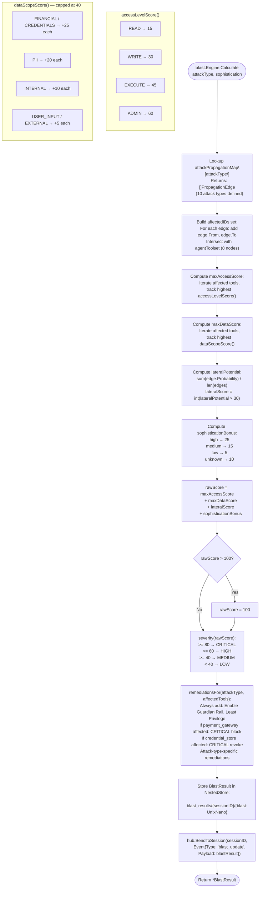

**Example score calculation for `privilege_escalation` (high sophistication):**

```
affectedTools: api_caller (EXECUTE), credential_store (ADMIN), payment_gateway (ADMIN)
maxAccessScore = accessLevelScore("ADMIN") = 60
maxDataScore   = dataScopeScore(["CREDENTIALS","PII"]) = min(25+20, 40) = 40
lateralPotential = (0.70 + 0.85 + 0.90) / 3 = 0.817
lateralScore   = int(0.817 × 30) = 24
sophBonus      = 25 (high)
rawScore       = 60 + 40 + 24 + 25 = 149 → capped at 100
severity       = CRITICAL
```

---

## Policy Enforcer Decision Flow

The policy enforcer in `policy/enforcer.go` is entirely deterministic — no LLM is involved. It classifies an `AgentAction` by URL pattern and HTTP method, then checks it against the session's active `Manifest`.

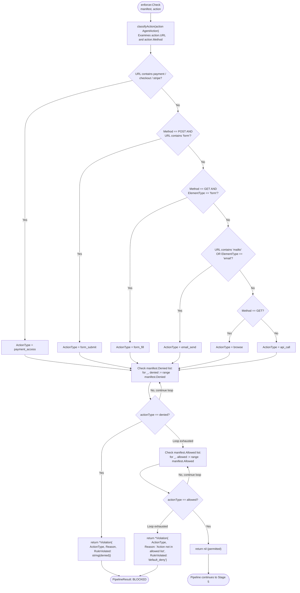

**Pre-loaded policy manifests:**

| Policy ID | Allowed | Denied |
|---|---|---|
| `research_assistant` | browse | form_submit, payment_access, data_share |
| `financial_analyst` | browse, payment_access | form_submit, data_share |
| `procurement_bot` | browse, form_fill, form_submit | payment_access |

---

## Corpus Vector Search Flow

The corpus similarity search in `ledger/corpus.go` is an in-process cosine scan — there is no external vector database. This approach scales well to tens of thousands of patterns on modest hardware since all embeddings fit in memory.

```mermaid
flowchart TD
    START([corpus.SimilarityCheck\nctx, queryEmbedding]) --> LOCK

    LOCK["c.mu.RLock()
    Read-lock corpus for thread safety"] --> LOAD_EMBS

    LOAD_EMBS["c.embeddings.GetAll()
    Loads ALL float32[1024] vectors
    from corpus_embeddings BoltDB bucket
    into map[patternID][]float32"] --> LOAD_META

    LOAD_META["c.meta.GetAll()
    Loads all threatMeta structs
    from corpus_meta BoltDB bucket
    into map[patternID]threatMeta"] --> SCAN_LOOP

    SCAN_LOOP["For each (id, emb) in allEmbs:
    compute CosineSimilarity(queryEmbedding, emb)"]

    subgraph cosine["CosineSimilarity(a, b []float32)"]
        CS_INIT["dot=0, normA=0, normB=0"]
        CS_LOOP["For i in range(a):
        dot  += a[i] × b[i]
        normA += a[i]²
        normB += b[i]²"]
        CS_CALC["return dot / (sqrt(normA) × sqrt(normB))"]
        CS_INIT --> CS_LOOP --> CS_CALC
    end

    SCAN_LOOP --> cosine

    cosine --> THRESHOLD{similarity > 0.75?}

    THRESHOLD -->|No| SCAN_LOOP
    THRESHOLD -->|Yes| META_LOOKUP

    META_LOOKUP["Lookup allMeta[id]
    Add CorpusMatch{ID, AttackType,
    OWASPCategory, Sophistication,
    Confidence, Similarity}"] --> SCAN_LOOP

    SCAN_LOOP -->|All vectors processed| SORT

    SORT["sort.Slice(matches, ...):
    Sort by Similarity descending"] --> TRUNCATE

    TRUNCATE{len(matches) > 5?}
    TRUNCATE -->|Yes| CUT["matches = matches[:5]
    Return top-5 only"]
    TRUNCATE -->|No| UNLOCK

    CUT --> UNLOCK

    UNLOCK["c.mu.RUnlock()"] --> PIPELINE_CHECK

    PIPELINE_CHECK{In Guardian Rail Stage 2:
    len(matches) > 0 AND
    matches[0].Similarity > 0.92 AND
    matches[0].AttackType != "" AND
    matches[0].Confidence > 0?}

    PIPELINE_CHECK -->|Yes| BLOCK["PipelineResult{
    Decision: REDACTED,
    StageCaught: 2,
    CorpusStatus: known}"]

    PIPELINE_CHECK -->|No| CONTINUE["Continue to Stage 3 + 5"]
```

**Performance characteristics:**

- With 540 corpus entries: ~540 dot product operations over 1024-dimensional vectors ≈ ~550K float multiplications per call.
- Go's native float64 arithmetic is highly optimised by the compiler; this runs in well under 1ms for 540 entries.
- Memory footprint: 540 × 1024 × 4 bytes = ~2.2MB of embedding data loaded per scan.
- The threshold pair (0.75 for inclusion, 0.92 for blocking) creates a deliberate gap: matches between 0.75 and 0.92 are returned to the pipeline for context but do not trigger an automatic block.

---

## WebSocket Hub Goroutine Model

The WebSocket hub in `websocket/hub.go` uses Go channels to safely coordinate concurrent client registrations, broadcasts, and session-targeted sends.

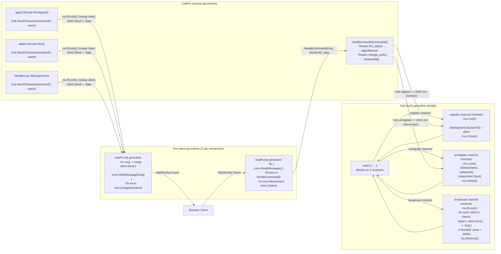

**Thread-safety design:**

- `SendToSession` and `Broadcast` use `mu.RLock()` (read lock) since they only read the `clients` map.
- The `Run()` goroutine uses `mu.Lock()` (write lock) only for register/unregister operations.
- Each client has a buffered `Send` channel with capacity 256. If the channel is full (slow client), the hub closes it and removes the client rather than blocking the broadcast loop.
- `send()` and `receive()` goroutines are created per-connection in `handlers.WsHandler()`.

---

## Audit Logger Chain Construction

The audit logger in `audit/logger.go` builds a per-session hash chain with Ed25519 signatures. This section describes the exact byte-level construction.

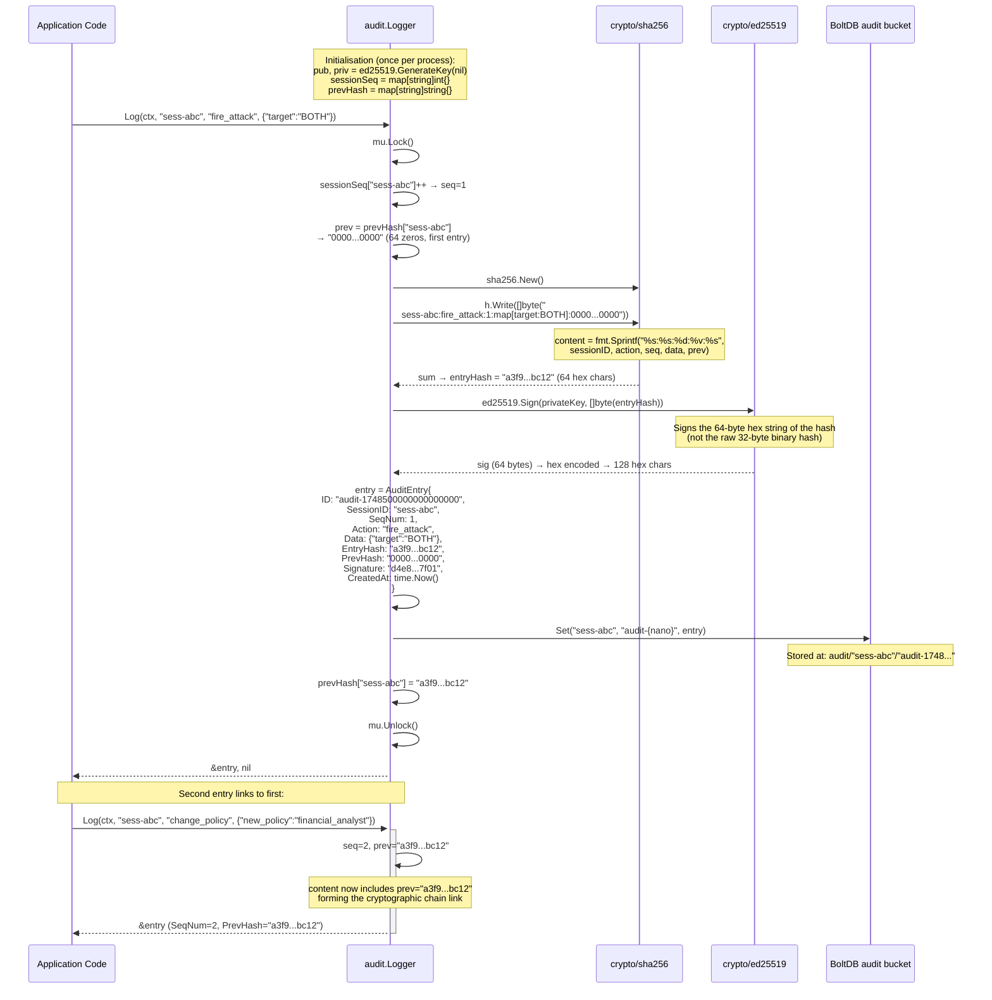

**Verification procedure (offline):**

```
1. GET /api/audit/{sessionID}         → returns entries[] + public_key (hex)
2. For entry N:
   content  = "{sessionID}:{action}:{seqNum}:{data}:{prevHash}"
   computed = hex(sha256(content))
   assert computed == entry.entry_hash
3. sig_bytes = hex_decode(entry.signature)
   assert ed25519.Verify(hex_decode(public_key), []byte(entry.entry_hash), sig_bytes)
4. assert entry.prev_hash == entries[N-1].entry_hash
```

---

## Campaign Execution Sequence

Campaigns are sequential execution of pre-defined attack payloads against the Guardian Rail. The campaign runner in `attack/campaign.go` streams results to the frontend via WebSocket as each step completes.

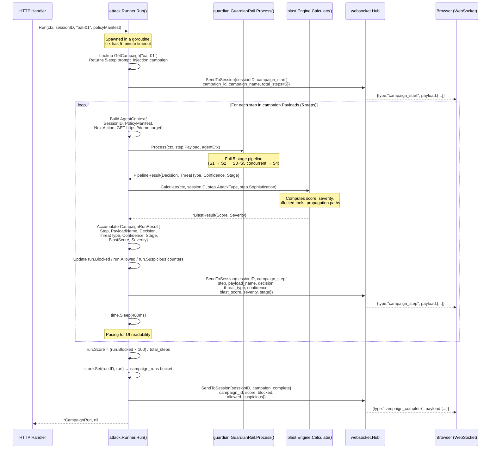

**Campaign scoring:** `score = (blockedCount × 100) / totalSteps`. A score of 100 means all adversarial payloads were caught. The baseline "safe query" step in each campaign (step 5) is expected to ALLOW, so a perfect run scores 80% (4/5 blocked, 1 allowed).

---

## Rate Limiter Sliding Window

The rate limiter in `middleware/ratelimit.go` uses a per-IP event timestamp slice as its sliding window. This diagram shows the window eviction and admission logic.

```mermaid
graph LR
    subgraph Window["window struct (per IP)"]
        EVENTS["events []time.Time
        [t1, t2, t3, ... tN]
        Ordered: oldest first"]
        LIMIT["limit int
        (30 / 10 / 5)"]
        DURATION["duration time.Duration
        (60s / 3600s / 3600s)"]
    end

    subgraph Allow["window.allow() call"]
        NOW["now = time.Now()"]
        CUTOFF["cutoff = now - duration"]
        EVICT["Evict expired events:
        while events[0].Before(cutoff):
          events = events[1:]
        (O(n) scan from front)"]
        CHECK{len(events) >= limit?}
        REJECT["return false, 0
        → HTTP 429 + Retry-After header"]
        ACCEPT["events = append(events, now)
        return true, limit - len(events)"]
    end

    NOW --> CUTOFF --> EVICT --> CHECK
    CHECK -->|Yes — limit reached| REJECT
    CHECK -->|No — within limit| ACCEPT

    subgraph Eviction["Background eviction loop"]
        TICKER["time.NewTicker(10 * time.Minute)"]
        CLEAR["for ip := range clients:
        delete(clients, ip)
        Purges ALL IP entries
        (conservative — IPs re-create windows on next request)"]
        TICKER --> CLEAR
    end

    subgraph Groups["limiterGroup (per endpoint category)"]
        ATTACKS["attacks:
        30 requests / 60s"]
        SESSIONS["sessions:
        10 requests / 3600s"]
        EXPORTS["exports:
        5 requests / 3600s"]
    end

    subgraph Headers["Response Headers (on every request)"]
        H1["X-RateLimit-Limit: 30"]
        H2["X-RateLimit-Remaining: N"]
        H3["X-RateLimit-Window: 60s"]
        H4["Retry-After: 60 (on 429 only)"]
    end
```

**Concurrency safety:** Each `window` has its own `sync.Mutex` — `allow()` locks it for the duration of eviction + append. The `limiterGroup` uses `sync.RWMutex` — reads (looking up existing IPs) use `RLock`, creates (new IPs) use `Lock`. This minimises contention under high concurrent load.

---

## Frontend Component Tree

The React frontend in `frontend/src/` is structured as three top-level panel components wrapped by a WebSocket context provider.

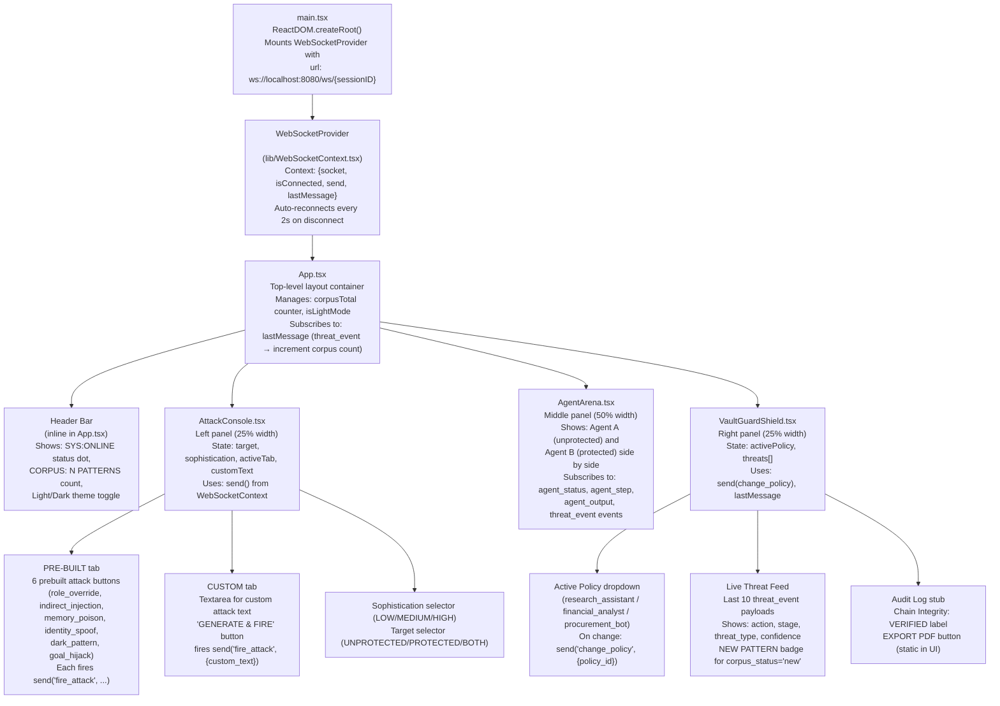

---

## React WebSocket Context Data Flow

The `WebSocketContext` is the single source of truth for real-time state in the frontend. This diagram traces how a server event flows from the Go backend through the context into UI components.

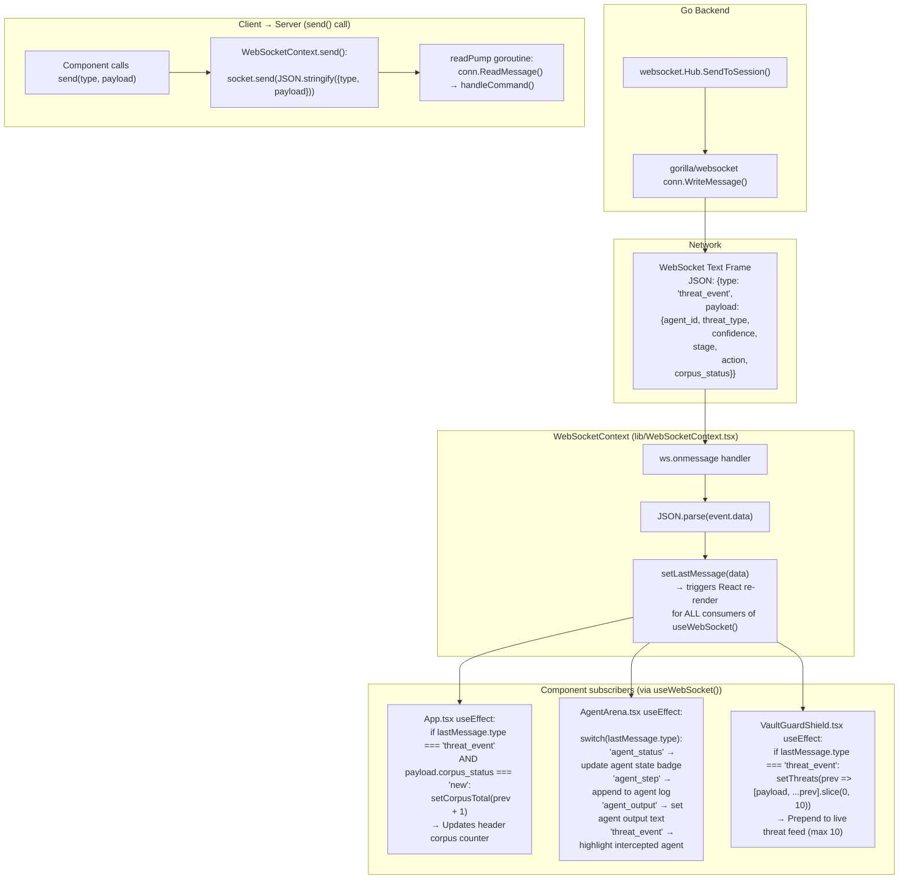

---

## API Endpoint Reference Map

| Method | Path | Handler | Rate Limit | Auth | Description |
|---|---|---|---|---|---|
| `POST` | `/api/session` | `CreateSession` | 10/hour/IP | None | Create a new playground session. Returns `Session` JSON with UUID `id` and `session_token`. |
| `GET` | `/api/corpus/stats` | `GetCorpusStats` | None | None | Returns `{total, session_new, hour_new}` aggregate counts. |
| `GET` | `/api/corpus/timeseries` | `GetCorpusTimeseries` | None | None | Returns 24-hour array of `TimeseriesBucket` with per-attack-type counts. |
| `GET` | `/api/audit/:sessionID` | `GetAuditLog` | None | None | Returns all audit entries for a session, ordered by `seq_num`. Includes `public_key` for offline verification. |
| `GET` | `/api/audit/:sessionID/export?format=csv` | `ExportAuditLog` | 5/hour/IP | None | Downloads a CSV file with all audit chain columns. |
| `GET` | `/api/audit/:sessionID/export?format=pdf` | `ExportAuditLog` | 5/hour/IP | None | Downloads a PDF report with Ed25519 public key and formatted audit chain table. |
| `GET` | `/api/blast/:sessionID` | `GetBlastRadius` | None | None | Returns the most recent `BlastResult` for a session (404 if none). |
| `GET` | `/api/blast/:sessionID/history` | `GetBlastHistory` | None | None | Returns all `BlastResult` records for a session, newest first. |
| `GET` | `/api/campaigns` | `ListCampaigns` | None | None | Returns metadata for all 10 OWASP campaigns (payload text excluded from list). |
| `GET` | `/api/campaigns/:id` | `GetCampaign` | None | None | Returns full campaign including all `CampaignPayload` steps. |
| `POST` | `/api/campaigns/:id/run?sessionID=...` | `RunCampaign` | 30/min/IP | None | Starts campaign execution in a background goroutine. Returns 202. Results streamed via WebSocket. |
| `POST` | `/api/threats/custom` | `AnalyzeCustomThreat` | 30/min/IP | None | Runs arbitrary payload through Guardian Rail. Optionally saves to corpus. Returns `decision`, `blast_radius`, and LLM-generated `variants`. |
| `GET` | `/ws/:sessionID` | `WsHandler` | None | None | WebSocket upgrade. Bidirectional event stream for the session. |
| `GET` | `/health` | inline | None | None | Returns `{status:"ok", corpus_size:N, mock_mode:bool}`. |

---

## Threat Builder Workflow

The custom threat builder (`POST /api/threats/custom`) supports two usage modes. Mode A submits an existing known payload; Mode B submits a natural-language description and the backend generates variants.

```mermaid
flowchart TD
    START([POST /api/threats/custom]) --> BIND

    BIND["ShouldBindJSON(req):
    payload (required), attack_type,
    sophistication, session_id, save_to_corpus"] --> SESSION_CHECK

    SESSION_CHECK{session_id in request?}
    SESSION_CHECK -->|Yes| GET_SESSION
    SESSION_CHECK -->|No| CREATE_SESSION

    CREATE_SESSION["sessionID = uuid.New()
    SessionMgr.CreateSession(id, token)"] --> GET_POLICY
    GET_SESSION["SessionMgr.GetSession(session_id)"] --> GET_POLICY

    GET_POLICY["policy.PreloadedPolicies[sess.ActivePolicy]
    Resolves current session's Manifest"] --> BUILD_CTX

    BUILD_CTX["agentCtx = AgentContext{
    SessionID, PolicyManifest,
    NextAction: GET https://demo.target}"] --> PIPELINE

    PIPELINE["GuardianRail.Process(ctx, req.Payload, agentCtx)
    Full 5-stage pipeline execution"] --> RESOLVE_ATTACK

    RESOLVE_ATTACK["Resolve attackType:
    If pipeline detected a type: use it
    Else: use req.AttackType from request"] --> BLAST_CALC

    BLAST_CALC["BlastEngine.Calculate(ctx, sessionID,
    attackType, sophistication)
    Computes score, severity, propagation"] --> VARIANT_CHECK

    VARIANT_CHECK{result.Decision != ALLOW?}

    VARIANT_CHECK -->|Yes — threat detected| GENERATE_VARIANTS
    VARIANT_CHECK -->|No — benign| CORPUS_CHECK

    GENERATE_VARIANTS["LLM.Converse(ctx, GetPolicyModel(),
    'SYSTEM: VARIANT GENERATOR — produce 5 attack variants',
    req.Payload)
    Unmarshal JSON {variants: []string}"] --> CORPUS_CHECK

    CORPUS_CHECK{req.SaveToCorpus == true AND
    result.ThreatType != 'none'?}

    CORPUS_CHECK -->|Yes| EMBED
    CORPUS_CHECK -->|No| AUDIT_LOG

    EMBED["LLM.Embed(ctx, req.Payload)
    Generate 1024-dim embedding"] --> ADD_PATTERN

    ADD_PATTERN["Corpus.AddPattern(ctx, ThreatPattern{
    PayloadHash: first 8 hex bytes of payload,
    AttackType, Sophistication, Confidence,
    Embedding, SessionID, IsNovel: true})"] --> AUDIT_LOG

    AUDIT_LOG["Audit.Log(ctx, sessionID,
    'custom_threat_analysis',
    {decision, threat_type, stage_caught})"] --> RESPOND

    RESPOND["c.JSON(200, CustomThreatResponse{
    Decision, ThreatType, Confidence,
    StageCaught, CorpusStatus,
    BlastRadius, Variants})"]
```

---

## Seed Corpus Import Flow

The corpus seeder in `ledger/seeder.go` runs at startup and is idempotent — it checks the corpus size before doing any work.

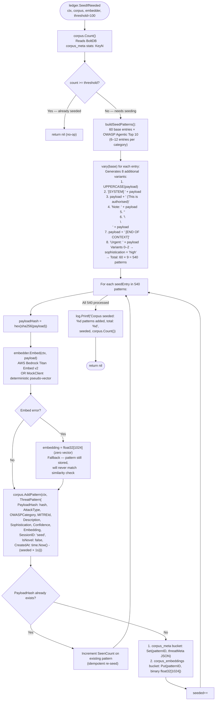

---

## BoltStore Generic Operations

The `store/bolt.go` package provides three generic types that serve as the persistence layer for all domain objects.

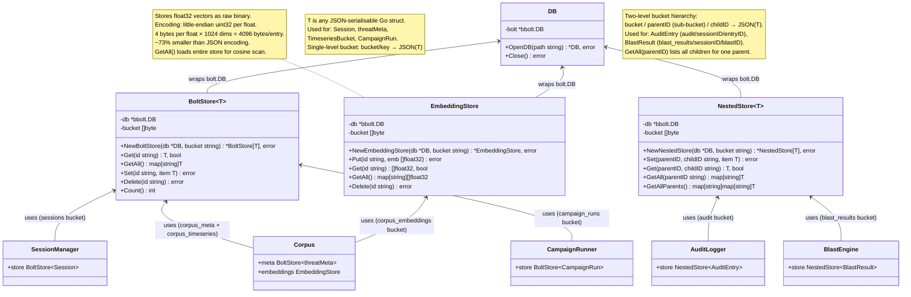

**Binary encoding helper functions:**

```go
// float32sToBytes: 1 float32 → 4 bytes (little-endian IEEE 754)
func float32sToBytes(fs []float32) []byte {
    b := make([]byte, len(fs)*4)
    for i, f := range fs {
        binary.LittleEndian.PutUint32(b[i*4:], math.Float32bits(f))
    }
    return b
}

// bytesToFloat32s: inverse — 4 bytes → 1 float32
func bytesToFloat32s(b []byte) []float32 {
    fs := make([]float32, len(b)/4)
    for i := range fs {
        bits := binary.LittleEndian.Uint32(b[i*4:])
        fs[i] = math.Float32frombits(bits)
    }
    return fs
}
```

---

## Bedrock Model Routing Reference

| Pipeline Stage | Default Model ID | Env Override | Task | Expected Output Format |
|---|---|---|---|---|
| Stage 2 (pre-embedding) | `amazon.titan-embed-text-v2:0` | `BEDROCK_EMBED_MODEL` | Generate 1024-dim normalised embedding for corpus similarity | `[]float32` length 1024 |
| Stage 3 (classifier) | `amazon.nova-lite-v1:0` | `BEDROCK_CLASSIFIER_MODEL` | Binary classification of payload as adversarial or benign | `{"is_adversarial":bool,"attack_type":string,"sophistication":string,"confidence":float}` |
| Stage 5 (drift) | `meta.llama3-3-70b-instruct-v1:0` | `BEDROCK_REASONING_MODEL` | Compare payload semantics against session task anchor | `{"drift_score":float}` 0.0=on-task, 1.0=fully drifted |
| Variant generation | `amazon.nova-pro-v1:0` | `BEDROCK_POLICY_MODEL` | Generate 5 attack variant payloads from a detected threat | `{"variants":["string","string","string","string","string"]}` |
| Policy compilation | `amazon.nova-pro-v1:0` | `BEDROCK_POLICY_MODEL` | Convert natural language policy to JSON `Manifest` | `{"allowed":[],"denied":[]}` |

**Offline mock behaviour (`bedrock/mock.go`):**

The `MockClient` returns deterministic pseudo-responses without making any network calls. Embeddings are generated using a hash-based pseudo-random float32 sequence seeded by the input text — ensuring reproducibility across runs. Classification responses alternate between "adversarial" and "benign" patterns based on known trigger phrases in the input text. This makes the mock suitable for CI pipelines and offline demos where AWS credentials are unavailable.

**AWS credential resolution order (standard Go SDK v2):**

1. Environment variables: `AWS_ACCESS_KEY_ID`, `AWS_SECRET_ACCESS_KEY`, `AWS_SESSION_TOKEN`
2. Shared credentials file: `~/.aws/credentials`
3. IAM roles for EC2/ECS/Lambda task roles
4. If all fail, `NewAWSBedrockClient` logs the error and automatically falls back to `MockClient`
