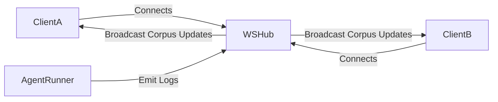

# Low Level Design

## Bedrock Model Routing Strategy
VaultGuard uses a multi-model routing strategy to optimize latency and cost.

| Pipeline Stage | Model Used | Reason |
|---|---|---|
| Stage 3 (Classification) | Amazon Nova Lite / Claude 3 Haiku | Fast, cheap classification. |
| Stage 5 (Goal Drift) | Claude 3 Haiku | Good balance of speed and semantic context mapping. |
| Policy Compilation | Claude 3 Sonnet | High reasoning capability required to convert English to JSON manifests. |
| Payload Generation | Claude 3 Sonnet | Requires creativity and understanding of HTML/DOM injection. |
| Stage 2 (Corpus) | Amazon Titan Embed Text v2 | High-speed vector embeddings for cosine similarity. |

## Local Disk Storage Layer
In this specific local implementation, `Supabase (PostgreSQL)` and `Redis` are abstracted out into thread-safe, generic Go Disk Stores.

```go
type Store[T any] struct {
	mu       sync.RWMutex
	filePath string
	Data     map[string]T
}
```

This allows offline execution while adhering to standard interface contracts so PostgreSQL can be slotted in easily via DB Interfaces later.

## WebSocket Hub
We implement a Go-channel based Pub/Sub mechanism to replace Redis broadcasts.

